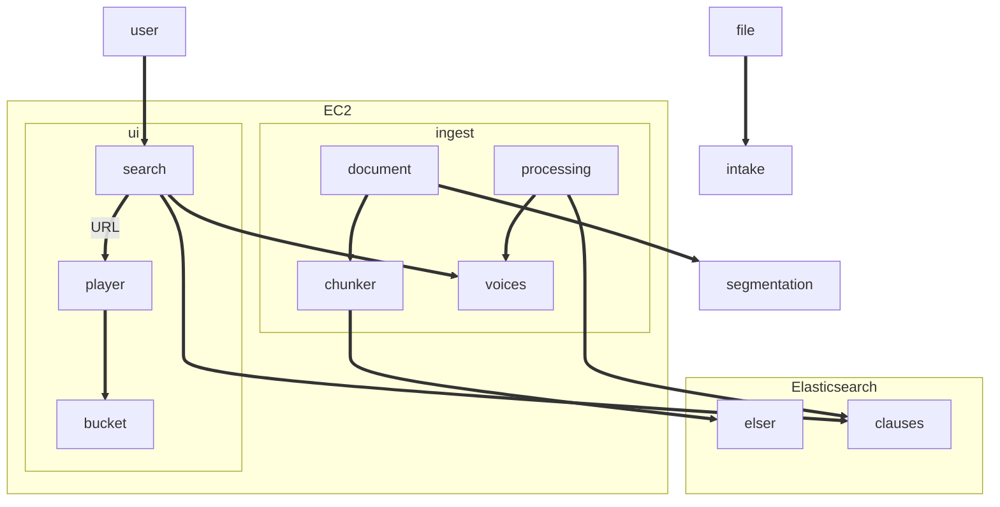

# ElasticDocs

```mermaid
flowchart TB

    document ==> segmentation


    subgraph Elasticsearch
        elser
        clauses
    end

    subgraph EC2
        subgraph ingest
            document ==> chunker
            chunker ==> elser
            processing ==> clauses
            processing ==> voices
        end
        subgraph ui
            search ==> clauses
            search ==> voices
            search == "URL" ==> player
            player ==> bucket
        end
    end

    user ==> search
    file ==> intake
```